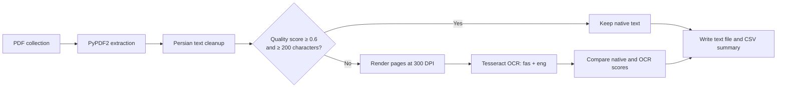

# Persian PDF Text Extraction


A notebook-based pipeline for extracting and cleaning Persian text from both digital and scanned PDF collections. It tries native PDF extraction first, scores the result, and falls back to Persian/English OCR when the extracted text is too short or low quality.

> This is a research and dataset-preparation workflow, not a packaged Python library. Review extracted text before using it in production or high-stakes applications.

## Why this project

Persian PDF collections often mix searchable documents with scanned pages. A single extraction method is therefore unreliable: native parsing is fast but cannot read images, while OCR is slower and can introduce errors. This workflow uses a quality-aware fallback so OCR runs only when it is likely to improve the result.

## Pipeline



## What it demonstrates

- Recursive discovery of PDF files
- Native text extraction with `PyPDF2`
- Conditional OCR with `pdf2image` and Tesseract
- Persian and Arabic character normalization
- Heuristic quality scoring for extracted text
- Selection of the better native/OCR result
- Parallel batch processing with resumable CSV tracking
- Post-processing for downstream NLP and dataset preparation

## Repository contents

| Path | Purpose |
|---|---|
| [`PDF_Text_Extraction.ipynb`](./PDF_Text_Extraction.ipynb) | Complete extraction, scoring, OCR, and cleanup workflow |
| [`pdf_extraction_summary.csv`](./pdf_extraction_summary.csv) | Example batch-processing summary |
| [`requirements.txt`](./requirements.txt) | Python dependencies |

## Quick start

### 1. Install system dependencies

Ubuntu/Debian:

```bash
sudo apt-get update
sudo apt-get install -y poppler-utils tesseract-ocr tesseract-ocr-fas
```

macOS with Homebrew:

```bash
brew install poppler tesseract tesseract-lang
```

Verify that Persian OCR data is available:

```bash
tesseract --list-langs
```

The output should include `fas`.

### 2. Install Python dependencies

```bash
python -m pip install -r requirements.txt
```

### 3. Configure the notebook

Open [`PDF_Text_Extraction.ipynb`](./PDF_Text_Extraction.ipynb) in Jupyter or Google Colab and change these paths for your environment:

- `ROOT_FOLDER`: directory containing the source PDFs
- `INPUT_DIR`: directory containing extracted text for post-processing
- `OUTPUT_DIR`: destination for cleaned text

The notebook currently includes Google Drive examples for Colab.

### 4. Run the workflow

Run the notebook cells in order. For every processed PDF, the pipeline writes a text file and records:

- source directory and filename;
- selected extraction method;
- native extraction score;
- OCR score;
- final score; and
- output path.

Previously recorded filenames are skipped when the batch is resumed.

## Quality-selection logic

The notebook first extracts text with PyPDF2 and calculates a heuristic score using Persian-character ratio, text length, unexpected characters, and repetition. OCR is attempted when the native result scores below `0.6` or contains fewer than `200` characters. If OCR runs, the higher-scoring result is kept.

These thresholds are practical defaults, not universal accuracy guarantees. Tune them against a labeled sample from your own document collection.

## Limitations

- Multi-column pages, tables, handwriting, and low-resolution scans may require specialized layout models.
- The quality score estimates text cleanliness; it is not character-level OCR accuracy.
- Tesseract language-pack availability varies by operating system.
- Paths in the notebook are examples and must be adapted outside Google Colab.
- Extracted documents may contain private or copyrighted information; confirm that you are authorized to process and store them.

## Suggested next steps

- Move reusable functions from the notebook into a tested Python package
- Add a command-line interface and configuration file
- Evaluate character and word error rates on a labeled Persian test set
- Add layout-aware extraction for tables and multi-column documents
- Add automated tests for normalization and quality scoring

## Author

**Ali Ebrahimi** — Applied AI and Persian NLP

[GitHub](https://github.com/ali-ebrahimii) · [LinkedIn](https://www.linkedin.com/in/ali-ebrahimi-264236241/)
